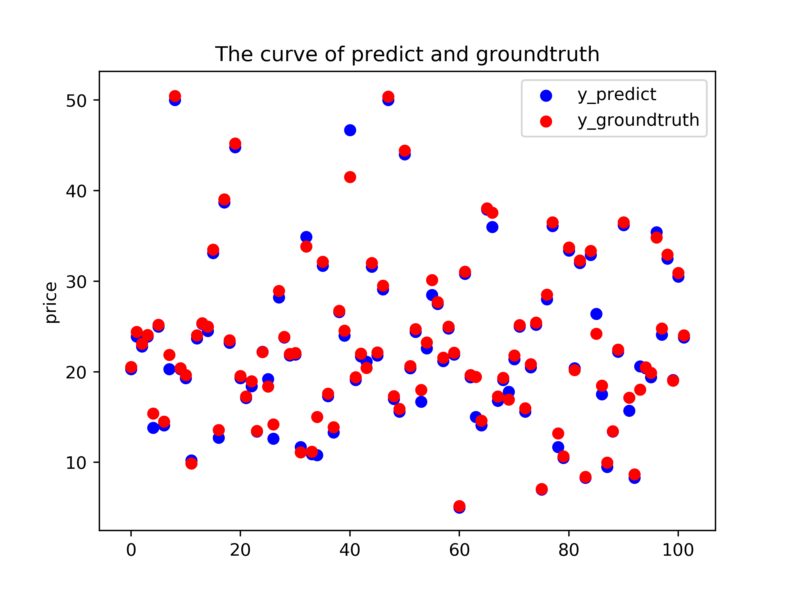
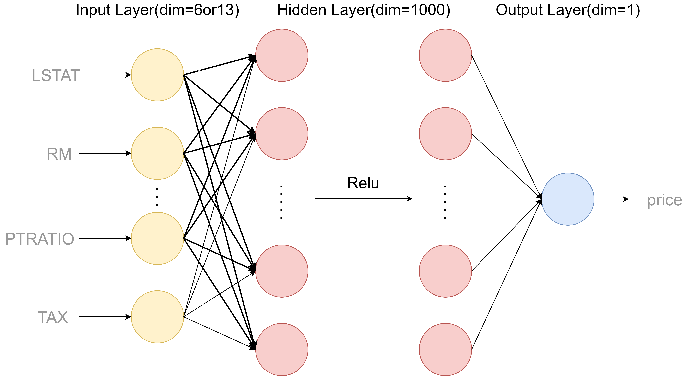
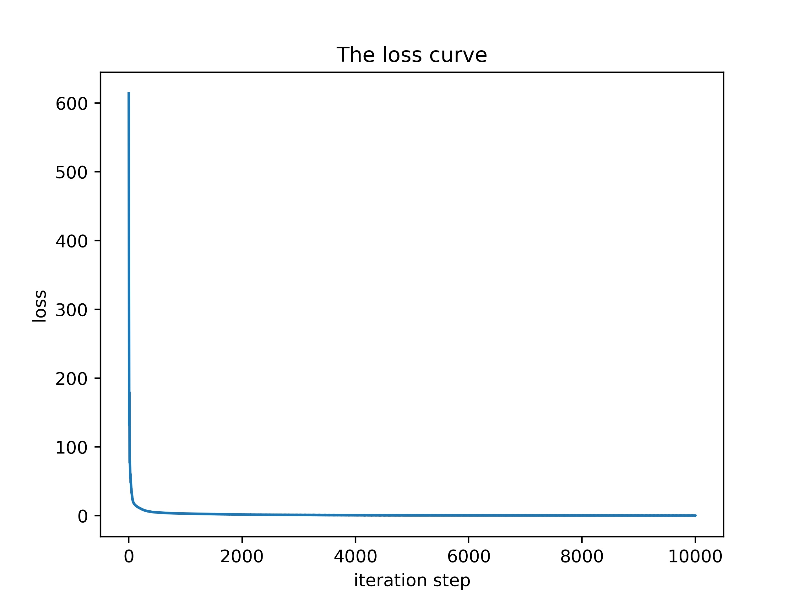

### BostonPredict

​	此仓库用来对波士顿问题进行预测，使用sklearn中的公开数据集，不过在data里面也附录了一份数据集，基于pytorch实现最终的模型。

​	对应博客地址为：[利用神经网络进行波士顿房价预测 - Zs's blog](https://www.zzsqwq.cn/index.php/archives/182/)

​	最终效果如下：



### Network Sructure

​	网络是一个二层的前馈神经网络，结构图大致如下：



### Requirements

​	需要Python 3.6 及以上版本，低版本可能也能用，需要大家自己尝试，在仓库根目录中使用如下命令来安装**requirements.txt** 中的所有的依赖

```bash
$ pip install -r requirements.txt
```


### Predict

​	仓库中主要包含两个文件：predict.py 和 Regression.py

+ **predict.py** 

  实现了利用前馈神经网络对波士顿房价进行预测，包含训练和预测两部分，里面有部分可选参数，具体如下：
  
  ```bash
  $ python predict.py -h
  
  usage: predict.py [-h] [--weights WEIGHTS] [--load_weights]
                    [--hidden_layer HIDDEN_LAYER] [--learn_rate LEARN_RATE]
                    [--input_shape INPUT_SHAPE]
                    [--load_cols LOAD_COLS [LOAD_COLS ...]] [--epoch EPOCH]
  
  optional arguments:
    -h, --help            show this help message and exit
    --weights WEIGHTS     inital weights path
    --load_weights        load weights or not
    --hidden_layer HIDDEN_LAYER
                          The dim of hidden_layer
    --learn_rate LEARN_RATE
                          The learning rate
    --input_shape INPUT_SHAPE
                          The input_shape of networks,don't forget change
                          load_cols
    --load_cols LOAD_COLS [LOAD_COLS ...]
    --epoch EPOCH         The epoch of train
  ```
  
+ **Regression.py**
  
  此文件实现了利用 **sklearn** 中常见的回归模型对房价进行预测。


### Pretrained model

​	在weights目录下有我训练好的一个预训练模型 **Boston.pt** ，其中 hidden_layer=1000, epoch=10000, learn_rate=0.01

​	最终loss大概为 0.03 左右




